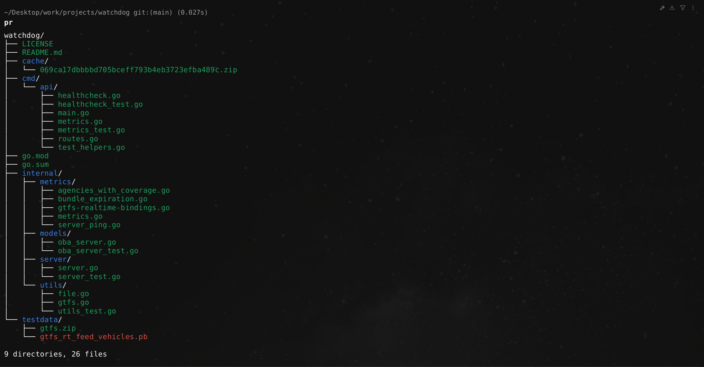

# PrintLayout 🌳



PrintLayout is a powerful, customizable command-line tool for printing directory structures in a tree format. Built with Go for simplicity and performance, it offers extensive features for visualizing and exploring file systems.

## 🚀 Installation

### Pre-Built Binaries

Download the appropriate binary for your operating system from the [Releases page](https://github.com/Ahmedhossamdev/PrintLayout/releases).

#### Linux/macOS
```bash
# Download binary
chmod +x pr-linux-amd64
sudo mv pr-linux-amd64 /usr/local/bin/pr

# Run
pr -dir /path/to/your/folder
```

#### Windows
1. Download `pr-windows-amd64.exe`
2. Move to a directory in your `PATH`

## 📋 Command-Line Flags

### Basic Flags

| Flag | Description | Default | Example |
|------|-------------|---------|---------|
| `--dir` | Specify directory to print | Current directory | `pr --dir /path/to/folder` |
| `--ext` | Filter files by extension | All files | `pr --ext .go` |
| `--output` | Save output to file | Terminal output | `pr --output output.txt` |
| `--no-color` | Disable colored output | Colors enabled | `pr --no-color` |

### Sorting Flags

| Flag | Description | Options | Default | Example |
|------|-------------|---------|---------|---------|
| `--sort-by` | Sort criteria | `name`, `size`, `time` | `name` | `pr --sort-by size` |
| `--order` | Sorting order | `asc`, `desc` | `asc` | `pr --sort-by time --order desc` |

### Exclusion Flags

| Flag | Description | Default | Example |
|------|-------------|---------|---------|
| `--exclude` | Exclude files/dirs matching pattern | No exclusions | `pr --exclude "*.log"` |

### Output Format Flags

| Flag | Description | Options | Default | Example |
|------|-------------|---------|---------|---------|
| `--format` | Output format | `text`, `json`, `xml`, `yaml` | `text` | `pr --format json` |

### Color Customization Flags

| Flag | Description | Options | Default | Example |
|------|-------------|---------|---------|---------|
| `--dir-color` | Directory color | `black`, `red`, `green`, `yellow`, `blue`, `magenta`, `cyan`, `white` | `blue` | `pr --dir-color green` |
| `--file-color` | File color | Same as above | `green` | `pr --file-color yellow` |
| `--exec-color` | Executable file color | Same as above | `red` | `pr --exec-color magenta` |

### Supported Colors (We will add more)

printLayout supports the following colors for customization:

- `black`
- `red`
- `green`
- `yellow`
- `blue`
- `magenta`
- `cyan`
- `white`

## 🔍 Basic Examples

### 1. Print the current directory structure
```bash
 pr
```
### 2. Specify a directory to explore
```bash
pr --dir ./path/to/project
```

### 3.Combined flags
```bash
pr --dir /path/to/project --ext .ts --sort-by size --order desc --exclude "node_modules" --exclude "*.test" --dir-color magenta --file-color cyan --output project_structure.txt
```

## 🛠 Development

### Run Project
```bash
go run ./cmd/main.go
```

### Run Tests
```bash
go test -v ./...
```

### Build Project
```bash
go build -o printlayout ./cmd/main.go
```

## 🤝 Contributing

1. Fork the repository
2. Create a feature branch
3. Commit changes
4. Push and submit a pull request

## 📜 License

I don't know about License stuff, but this project made by me

## 🙏 Acknowledgments

- Built with Go
- Inspired by GNU Tree


## License

This project is licensed under the [MIT License](LICENSE).
